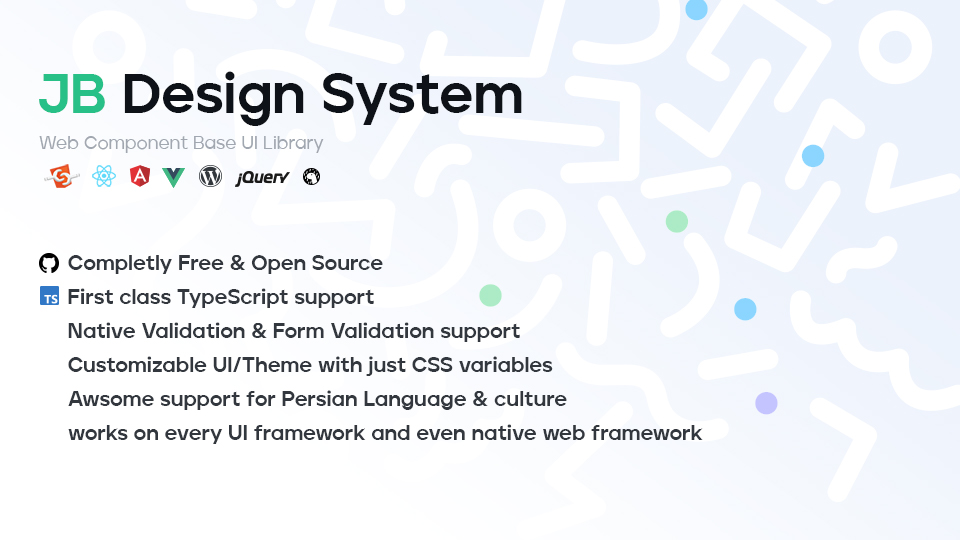

# JB Design System ✨

Web component based UI packages for building multilingual, RTL-ready web applications.



JB Design System is a collection of focused UI packages. Each component ships as a standards-based web component, and most components also include a React wrapper. Teams can install only the packages they need instead of adopting one large all-in-one bundle.

## Why Teams Use It 💡

- 🧩 **Framework friendly:** use the web components in React, Vue, Angular, Svelte, vanilla JavaScript, or any stack that can render custom elements.
- ⚛️ **React ready:** install the same package and import from `package-name/react` when you want typed React components.
- 📝 **Form focused:** inputs, pickers, validation, form collection, and high-interaction controls are treated as first-class product UI.
- 🌐 **RTL and Persian ready:** locale, direction, Persian calendar, and Persian number support are built into the system instead of patched on per app.
- 🎨 **Themeable by design:** components expose CSS custom properties, parts, and states so applications can style them without forking internals.
- 📦 **Small by choice:** packages are independent, so product teams can adopt gradually.

## Start Here 🚀

Explore the live documentation and examples:

- [Storybook documentation](https://javadbat.github.io/design-system/?path=/docs/getting-started-introduction--docs)
- [Component package list](https://javadbat.github.io/design-system/?path=/docs/general-package-list--docs)
- [Contribution guide](https://javadbat.github.io/design-system/?path=/docs/general-contribution-guide--docs)
- [CodeSandbox React demo](https://codesandbox.io/p/sandbox/jb-design-system-3f63dj)

## Install One Component ⚡

Install the package that matches the UI you need.

```bash
npm install jb-input
```

Use it as a web component:

```js
import "jb-input";
```

```html
<jb-input label="First name" name="firstName"></jb-input>
```

Or use its React wrapper:

```jsx
import { JBInput } from "jb-input/react";

export function ProfileForm() {
  return <JBInput label="First name" name="firstName" />;
}
```

## Choose Packages 🧭

Start with the package closest to the user task:

| Need | Packages |
| --- | --- |
| Text, number, mobile, password, payment, national ID, textarea, PIN, date, or time entry | `jb-input`, `jb-number-input`, `jb-mobile-input`, `jb-password-input`, `jb-payment-input`, `jb-national-input`, `jb-textarea`, `jb-pin-input`, `jb-date-input`, `jb-time-input` |
| Selection and boolean choices | `jb-select`, `jb-checkbox`, `jb-switch` |
| Files, images, calendar, and time picking | `jb-file-input`, `jb-image-input`, `jb-calendar`, `jb-time-picker` |
| Validation and form value collection | `jb-validation`, `jb-form` |
| Overlays and feedback | `jb-modal`, `jb-popover`, `jb-tooltip`, `jb-notification`, `jb-loading` |
| Data and utility UI | `jb-grid`, `jb-searchbar`, `jb-infinite-scroll`, `jb-qrcode` |

See the [full component list](./docs/component-list.md) for package links.

## Build A Form 🧱

Most form controls support labels, messages, validation, disabled states, CSS customization, and native form participation.

```jsx
import { JBForm } from "jb-form/react";
import { JBInput } from "jb-input/react";
import { JBMobileInput } from "jb-mobile-input/react";
import { JBButton } from "jb-button/react";

export function SignupForm() {
  return (
    <JBForm onSubmit={(event) => console.log(event.target.value)}>
      <JBInput name="fullName" label="Full name" required />
      <JBMobileInput name="mobile" label="Mobile number" required />
      <JBButton type="submit">Create account</JBButton>
    </JBForm>
  );
}
```

## Theme And Localize 🎨

Set theme variables in any scope that should own the visual style.

```css
:root {
  --jb-primary: oklch(54% 0.18 250);
  --jb-input-border-radius: 0.5rem;
}
```

Set document language and direction once at the application shell.

```html
<html lang="fa" dir="rtl"></html>
```

For advanced locale control, use `jb-core/i18n`.

```js
import { i18n } from "jb-core/i18n";

i18n.setLocale(new Intl.Locale("fa", {
  calendar: "persian",
  numberingSystem: "arabext",
}));
```

## Repository Development 🛠️

This repository is the monorepo used to manage, test, document, and build the component packages. The packages live in `modules/`, mostly as Git submodules.

Clone with submodules:

```bash
git clone --recurse-submodules -j8 https://github.com/javadbat/design-system.git
```

If you already cloned the repository:

```bash
git submodule update --init --recursive
```

Install dependencies:

```bash
deno install
```

Build packages:

```bash
deno task build
deno task build --name=jb-input
deno task build --name=jb-input --watch
```

Start Storybook:

```bash
deno task start
```

Run checks:

```bash
deno task test
```

## Contributing 🤝

Use the [local contribution guide](./docs/contribution-guide.md) or the [Storybook contribution guide](https://javadbat.github.io/design-system/?path=/docs/general-contribution-guide--docs) before changing package behavior, docs, or build tooling.

Add a component submodule:

```bash
git submodule add -f https://github.com/user/repo.git modules/module-name
```

Remove a component submodule:

```bash
git rm modules/module-name
```
