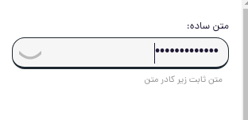
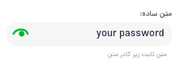

# jb-input-react

input component for react 

## installation

run `npm install jb-input-react` to install package with npm

## usage

use below syntax in your render function.

<JBInput></JBInput>

### label
use label property to describe your input.

```jsx
<JBInput label='your label name' ></JBInput>
```
### type

use type='password' for password input.
exapmle:

```jsx
<JBInput label='your label name' type='password' ></JBInput>
```

demo image:    



### message

constant message below input.
example:

```jsx
<JBInput label='your label name' message='your constant message' ></JBInput>
```

### set validation

you can set validation to your input:

```js
    titleInput.validationList = [
        {
            validator: /.{3}/g,
            message: 'عنوان حداقل باید سه کاکتر طول داشته باشد'
        },
        #you can use function as a validator too
        {
            validator: (inputedText)=>{return inputedText == "سلام"},
            message: 'شما تنها میتوانید عبارت سلام را وارد کنید'
        },
    ]
```