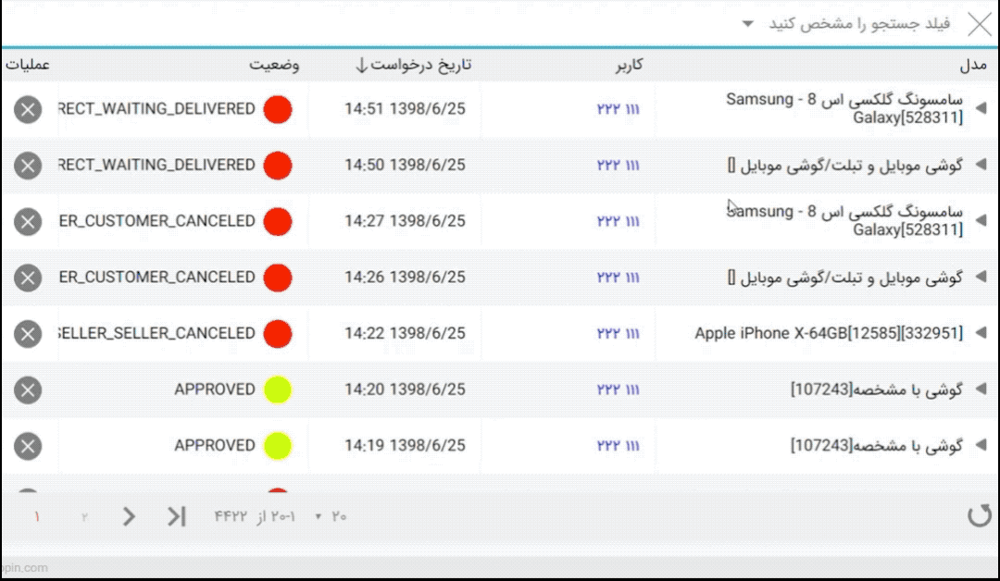

# jb-searchbar-react

bring you a search bar for custom filter of list or anything else you need to filter and has following benefit:

- support different type of filter like  text, number, date, list
- unlike big filter panel jb-searchbar take only 45px of height and can open up so much space for you
- good and smooth animation
- responsive
- you can limit the use of each filter for user 

## installation

run `npm install jb-searchbar-react` to install package with npm

## usage

import component in your page `import JBSearchBar from 'jb-searchbar-react'`  
you can import special edition for different envirement like es6 or requirejs or systemjs like:  
`import JBSearchBar from 'jb-searchbar-react/dist/JBSearchBar.cjs.min'` for requirejs version  
`import JBSearchBar from 'jb-searchbar-react/dist/JBSearchBar.min'` for standard es6  
`import JBSearchBar from 'jb-searchbar-react/dist/JBSearchBar.systemjs.min'` for systemjs  

use below syntax in your render function

`<JBSearchBar config={this.model.searchbarConfig} className="your-custom-class" onSearch={(e)=>this.model.onSearch(e)}></JBSearchBar>`  
config example:

```javascript
{
    columns=[
        {
            id:1,
            name:'UserId',
            caption:"شناسه کاربر",
            type:"number",
        },
        {
            id: 2,
            name:'UseName',
            caption:"نام کاربر",
            type:"text",
        },
        {
            id:3,
            name:'RegistrationDate',
            caption:"تاریخ ثبت نام",
            type:"date",
            [config:{/*jb-dateinput-react standard config*/}] //optional
        },
        {
            id:4,
            name:'Gender',
            caption:"جنسیت",
            type:"list",
            config:{
                /*the config is standard config of jb-selectbox-react*/
                options:[
                    {
                        value:"male",
                        caption:"آقا"
                    },
                    {
                        value:"female",
                        caption:"خانم"
                    },
                ],
                placeHolder:"جنسیت را انتخاب کنید"
            }
        }
    ]
    //after config binded to component you can call this function outside of component
    triggers={
       focus : undefined, //focus on filter bar
       injectFilter:undefined //you can add filter object dynmically in code
   }
   callBacks={
       onChange : undefined, //on user select or remove filter 
       oncolumnSelect:undefined, //on user select a column to set value but value is not set by user yet
       onHeightOverflow:undefined,//when user select a filter and it cant fit in searchbar width the searchbar expand and call this callback function so you can react to it in your code
       onHeightChange:undefined //like on onHeightOverflow but called when height grow or shrink and not just grow
   }
   //determine if you want trigger search button on filter bar value changed if set to false user have to click on search button after change the filter list value
   searchOnChange = true;//true or false,
   captions={
    unknownSelectedOptionCaption:"ستون نامشخص", //when selected column dont have caption
    unknownSelectedOptionValue:"مقدار نا مشخص" //when selected column dont have specified value
   }
}
```

triggers fill inside of component and you can call them outside of searchbar component.  
callBacks is defined by you and component will call them on event happend  
the onSearch prop get a function and when user click on a search button this function will called

demo image:  

